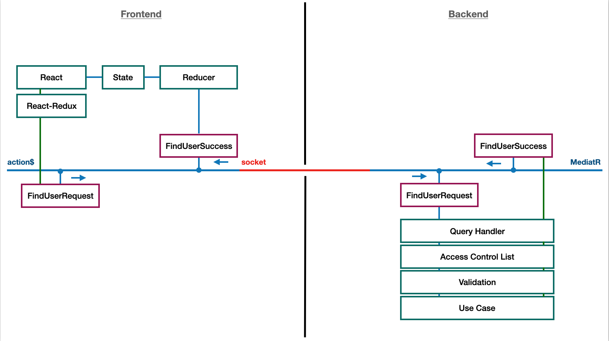

# Cortex

## Proof of Concept

In this application I am trying to send the Redux $action stream directly to the backend via a socket. The responses from the backend are in turn written directly back into the stream as an action.

## Working with Sockets locally 

I recommend using [ngrok](https://ngrok.com/) to have an ssl protected public url redirecting to localhost: 4004.

## Start the Application

The backend consists of an express application and can be started via *yarn start*.
The frontend consists of an react application and can be started via *yarn start*.
